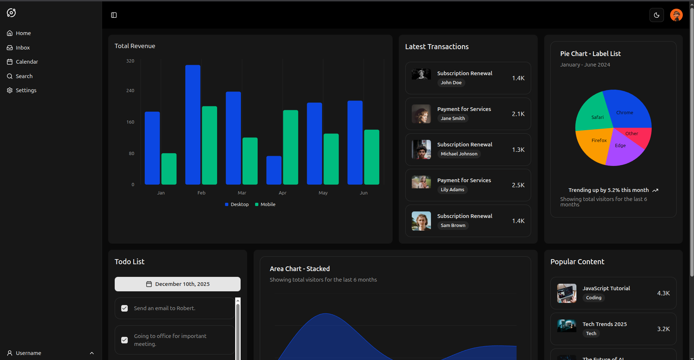

# SideProject Dashboard 🚀

A personal **dashboard web application** to manage daily productivity in one place.  
This project is built to experiment with modern frontend tools and create a clean, reusable UI for side projects.

---

## 📸 Screenshots

## ✨ Features

- 📋 **Todo List**
  - Add and manage daily tasks
  - Mark tasks as completed
- 📅 **Date-based task selection**
  - Pick a date using a calendar
  - View tasks per selected date
- 🎨 **Modern UI**
  - Built with reusable UI components
  - Clean and minimal design
- 🧩 **Scrollable task list**
  - Handles large number of tasks smoothly

---

## 🛠 Tech Stack

- **Frontend:** React (Client Components)
- **UI Library:** shadcn/ui
- **Icons:** lucide-react
- **Styling:** Tailwind CSS
- **Date Handling:** date-fns
- **State Management:** React Hooks
- **Version Control:** Git & GitHub

---

## 📂 Project Structure

SideProject-Dashboard/
│
├── components/
│ ├── ui/ # Reusable UI components
│ └── TodoList.jsx # Todo list feature
│
├── pages / app # Application entry (framework dependent)
├── styles # Global styles
└── README.md

## To start

npm install
npm run dev
